# **MeshLogIQ – Multi-Tenant Authentication & Authorization Architecture**
**Version:** 2.0 – 2026‑03‑01  
**Status:** Production-Ready Specification

---

## **Executive Summary**

This document defines the complete authentication, authorization, and multi-tenancy architecture for the MeshLogIQ platform. It introduces a three-tier subscription model (Free, Basic, Enterprise) with Keycloak-based identity management, role-based access control (RBAC), feature flagging, and comprehensive quota enforcement.

The architecture supports:
- **Multi-tenant isolation** with tenant-specific MinIO buckets and database partitioning
- **Three subscription tiers** with distinct device limits, storage quotas, and feature sets
- **Keycloak realm strategy** with shared realms for Free/Basic and optional dedicated realms for Enterprise
- **Role hierarchy** (owner, admin, developer, operator, viewer) with granular permissions
- **Device tracking and metering** for billing and compliance
- **Feature modularity** through JWT-embedded feature flags
- **Runtime enforcement** at multiple layers (API gateway, services, storage, message broker)

---

## **Table of Contents**

1. [Identity Types & Trust Anchors](#1-identity-types--trust-anchors)
2. [End-to-End Authentication Flows](#2-end-to-end-authentication-flows)
3. [Components & Responsibilities](#3-components--responsibilities)
4. [Detailed Architecture Diagrams](#4-detailed-architecture-diagrams)
5. [Data Structures & Schemas](#5-data-structures--schemas)
6. [Enforcement Points](#6-enforcement-points)
7. [References](#7-references)
8. [Tier Management & Billing Integration](#8-tier-management--billing-integration)

---

## **1. Identity Types & Trust Anchors** {#1-identity-types--trust-anchors}

### **1.1 Identity Categories**

MeshLogIQ distinguishes three primary identity types, each with tier-aware authentication mechanisms:

| Type | Actors | Authentication Mechanism | Tier Binding |
|------|--------|--------------------------|--------------|
| **Human Users** | Operators, admins, developers, analysts, viewers | **Keycloak OIDC** – JWTs contain `org_id`, `roles`, `subscription_plan`, `feature_flags`, `quotas` | Bound at organization level |
| **Devices** | Edge AI nodes (Jetson, Kria, Pi), gateways, MCU sensors | **mTLS** (device certificate) + short-lived **device JWT** (client-credentials flow) containing device-specific tier metadata | Bound at provisioning time, inherits org tier |
| **Services** | Django core, FastAPI microservices, ROS2 bridge | **mTLS** (service-to-service) + internal service tokens with system-level privileges | Not tier-bound (system-level) |

### **1.2 Trust Anchors**

- **Root / Intermediate CA** – Private PKI (HashiCorp Vault PKI or AWS Private CA) issues device certificates with embedded tenant and tier metadata.
- **Keycloak Realm Signing Keys** – Sign all user and device JWTs; public keys published via JWKS endpoint (`https://keycloak.meshlogiq.com/realms/{realm}/protocol/openid-connect/certs`).
- **mTLS Between Devices ↔ MQTT / API Gateway** – Certificates must validate against MeshLogIQ CA chain; includes tier-specific rate limits.

### **1.3 Subscription Tier Definitions**

| Tier | Max Devices | Storage Quota | API Throttling | Key Features | Keycloak Realm Strategy |
|------|-------------|---------------|----------------|--------------|------------------------|
| **Free** | 1 device | 2 GB | 100 req/min per device | Basic telemetry, video streaming, dashboard access | Shared `meshlogiq` realm |
| **Basic** | 5 devices | 25 GB | 500 req/min per device | Advanced analytics, model registry, webhooks, data export | Shared `meshlogiq` realm |
| **Enterprise** | 50+ (configurable) | 1 TB+ (configurable) | Non-throttled | Fleet management, custom integrations, dedicated support, advanced RBAC, audit logs, SLA guarantees | Option for dedicated realm (`meshlogiq-{org_id}`) |

### **1.4 Role Hierarchy & Permissions**

MeshLogIQ implements a hierarchical RBAC model with five standard roles:

| Role | Permissions | Typical Use Case | Can Invite Users | Can Manage Devices | Can Upgrade Tier |
|------|-------------|------------------|------------------|-------------------|------------------|
| **owner** | Full access to org, billing, tier management, user management, all device/data operations | Organization founder/primary admin | ✅ | ✅ | ✅ |
| **admin** | User management, device provisioning, feature configuration, data access | IT administrators, team leads | ✅ | ✅ | ❌ |
| **developer** | API access, model deployment, pipeline configuration, read/write data access | ML engineers, integration developers | ❌ | ⚠️ (provision only) | ❌ |
| **operator** | Device monitoring, operational controls, read/write telemetry, video access | Floor operators, field technicians | ❌ | ⚠️ (view only) | ❌ |
| **viewer** | Read-only access to dashboards, telemetry, videos, analytics | Stakeholders, auditors, analysts | ❌ | ❌ | ❌ |

**Permission Inheritance:** Roles are hierarchical – each role inherits permissions from roles below it in the hierarchy (owner > admin > developer > operator > viewer).

### **1.5 Feature Flag System**

Features are modular and enabled/disabled via JWT claims:

```json
{
  "feature_flags": {
    "fleet_management": true,        // Enterprise only
    "advanced_analytics": true,       // Basic & Enterprise
    "custom_integrations": true,      // Enterprise only
    "webhook_automation": true,       // Basic & Enterprise
    "audit_logging": true,            // Enterprise only
    "data_export": true,              // Basic & Enterprise (format limits apply)
    "model_registry": true,           // Basic & Enterprise
    "ros2_integration": true,         // Enterprise only
    "sla_monitoring": true            // Enterprise only
  }
}
```

**Enforcement:** Feature flags are checked at:
1. **API Gateway** – Request rejection if feature not enabled
2. **Service Layer** – Business logic gates
3. **Frontend** – UI element visibility (non-security boundary)

---

## **2. End-to-End Authentication Flows** {#2-end-to-end-authentication-flows}

### **2.1 Human User Authentication Flow (Tier-Aware)**

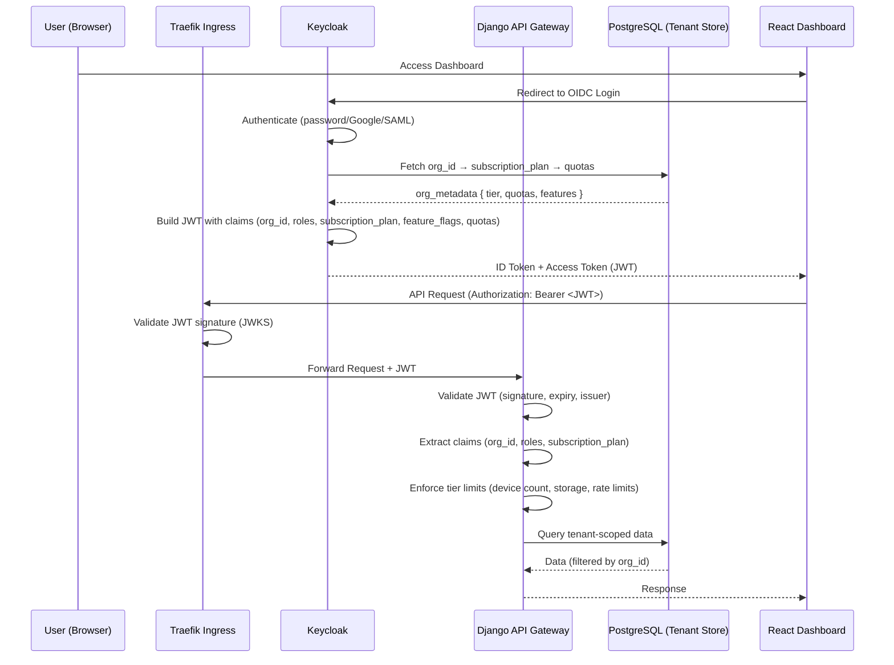

**Key Enhancements:**
1. **Keycloak enriches tokens** with subscription tier and feature flags by querying the tenant store during token issuance.
2. **Django API Gateway validates tier quotas** on every request:
   - Device count vs. tier limit
   - Storage usage vs. tier quota
   - Request rate vs. throttle limits
3. **Tenant isolation enforced** at database level via `org_id` filtering.

### **2.2 Device Provisioning Flow (Quota-Enforced)**

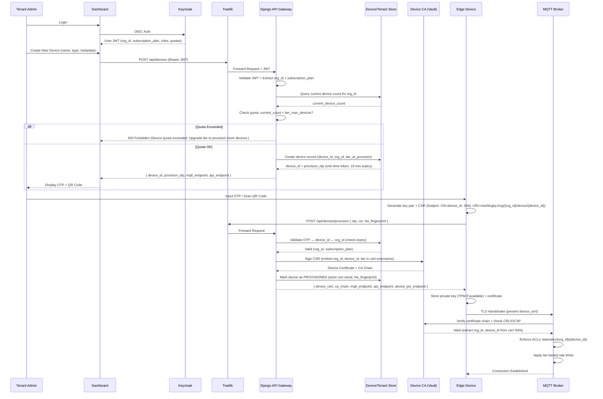

**Critical Quota Checks:**
1. **Provisioning Time:**
   - Reject if `current_device_count >= tier.max_devices`
   - Record `tier_at_provision` to handle downgrades gracefully
2. **Certificate Binding:**
   - Device certificate embeds `org_id` and `device_id` in SAN
   - Tier metadata stored in custom X.509 extension (optional)
3. **MQTT Broker:**
   - Extracts tenant from certificate
   - Applies tier-specific rate limits (e.g., 100 msg/min for Free, 500 msg/min for Basic, unlimited for Enterprise)

### **2.3 Device Runtime Authentication (MQTT + REST/gRPC)**

#### **2.3.1 MQTT Telemetry Streaming**

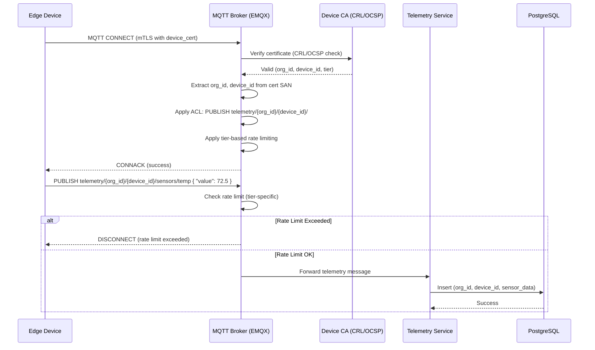

#### **2.3.2 REST API / gRPC Calls (Device JWT)**

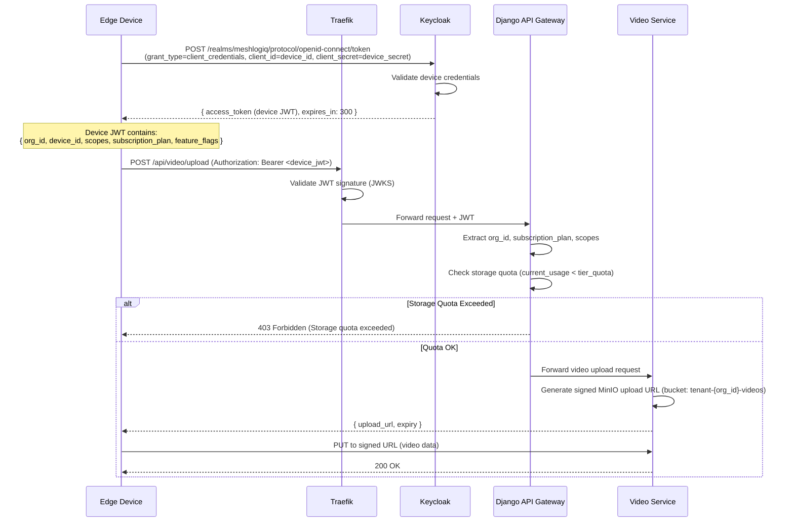

**Device JWT Claims:**
```json
{
  "iss": "https://keycloak.meshlogiq.com/realms/meshlogiq",
  "sub": "device_01H94T8Z2J3K4L5M6N7P8Q9R",
  "typ": "device",
  "org_id": "org_772B3C4D5E6F",
  "device_id": "device_01H94T8Z2J3K4L5M6N7P8Q9R",
  "scopes": ["telemetry:write", "video:upload", "status:read", "command:read"],
  "subscription_plan": "basic",
  "feature_flags": {
    "advanced_analytics": true,
    "data_export": true
  },
  "quotas": {
    "max_devices": 5,
    "storage_gb": 25,
    "rate_limit_rpm": 500
  },
  "exp": 1760000300,
  "iat": 1760000000
}
```

### **2.4 Service-to-Service Authentication**

Internal microservices use mTLS for secure communication:

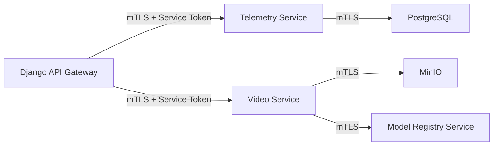

**Service Token Claims:**
```json
{
  "iss": "meshlogiq-internal",
  "sub": "service.django-api-gateway",
  "aud": ["telemetry-service", "video-service", "model-registry"],
  "scopes": ["internal:read", "internal:write", "tenant:impersonate"],
  "exp": 1760003600
}
```

---

## **3. Components & Responsibilities** {#3-components--responsibilities}

### **3.1 Component Overview**

| Component | Primary Responsibilities | Tier Enforcement Role |
|-----------|-------------------------|----------------------|
| **Keycloak (IdP)** | User/device authentication, token issuance, claim mapping (`org_id`, `subscription_plan`, `feature_flags`, `quotas`), realm management, Google federation | ✅ Embeds tier metadata in JWTs |
| **Traefik (Ingress)** | TLS termination, request routing, JWT signature validation (JWKS), rate limiting (tier-aware) | ✅ Enforces API rate limits at ingress |
| **Django API Gateway** | JWT validation, tenant resolution, RBAC/ABAC enforcement, device provisioning orchestration, quota checks (device count, storage), feature flag gating | ✅ Primary enforcement layer for quotas & features |
| **PostgreSQL** | Multi-tenant data store (partitioned by `org_id`), stores tenant metadata (tier, quotas, billing), device registry, user profiles | ✅ Stores tier configuration and usage metrics |
| **MinIO (Data Lake)** | Tenant-isolated object storage (videos, models, datasets, telemetry dumps), bucket policies enforce storage quotas | ✅ Enforces storage quotas via bucket policies |
| **MQTT Broker (EMQX)** | Device connectivity, mTLS authentication, topic ACLs (`telemetry/{org_id}/{device_id}/#`), tier-based rate limiting | ✅ Enforces message rate limits per tier |
| **FastAPI Microservices** | Business logic for telemetry, video, control, model registry; JWT validation on each request, scope checks, tenant isolation | ✅ Validates feature flags and scopes |
| **PKI / Device CA (Vault)** | Issue/revoke device certificates, embed `org_id` and `device_id` in SAN, CRL/OCSP for certificate validation | ✅ Binds devices to tenants at provisioning |
| **Redis (Cache)** | Session caching, rate limit counters (tier-aware), quota usage caching | ✅ Tracks real-time rate limit and quota usage |

### **3.2 Keycloak Configuration**

#### **3.2.1 Realm Strategy**

| Tier | Realm | Rationale |
|------|-------|-----------|
| **Free & Basic** | Shared `meshlogiq` realm | Cost-effective, simpler management, sufficient isolation via `org_id` claims |
| **Enterprise** | Dedicated `meshlogiq-{org_id}` realm (optional) | Custom branding, dedicated identity providers, compliance requirements (e.g., HIPAA, SOC2) |

#### **3.2.2 Keycloak Client Configuration**

1. **Web Dashboard Client** (OIDC confidential client)
   - Client ID: `meshlogiq-dashboard`
   - Flow: Authorization Code + PKCE
   - Token enrichment: Custom claim mapper adds `org_id`, `subscription_plan`, `feature_flags`, `quotas`

2. **Device Client** (OAuth2 client-credentials)
   - Client ID: `device_{device_id}`
   - Flow: Client Credentials
   - Credentials: Device-specific client secret (stored in device certificate)
   - Token type: `device`

3. **Service Client** (Internal service accounts)
   - Client ID: `service.{service_name}`
   - Flow: Client Credentials
   - Scopes: `internal:*`

#### **3.2.3 Custom Claim Mappers**

Keycloak custom mappers query PostgreSQL to enrich tokens:

```javascript
// Pseudo-code for Keycloak mapper script
function enrichToken(user, token, realm) {
  const tenant = db.query("SELECT * FROM tenants WHERE id = ?", user.org_id);
  
  token.org_id = tenant.id;
  token.subscription_plan = tenant.subscription_plan;
  token.quotas = {
    max_devices: tenant.tier_config.max_devices,
    storage_gb: tenant.tier_config.storage_gb,
    rate_limit_rpm: tenant.tier_config.rate_limit_rpm
  };
  token.feature_flags = tenant.feature_flags;
  
  return token;
}
```

#### **3.2.4 Identity Federation**

- **Google OAuth2** (Phase 1)
  - Automatic account linking via email
  - First-time login creates tenant if not exists (Free tier)
  
- **Azure AD / Okta** (Phase 2 - Enterprise only)
  - SAML 2.0 integration
  - Attribute mapping for roles and groups

### **3.3 MinIO Multi-Tenant Architecture**

#### **3.3.1 Bucket Naming Convention**

```
tenant-{org_id}-videos/
  ├── device-{device_id}/
  │   ├── 2026-03-01/
  │   │   ├── raw/
  │   │   ├── processed/
  │   │   └── clips/
  │   └── ...
  
tenant-{org_id}-models/
  ├── yolov8-custom-2026-03-01/
  │   ├── model.onnx
  │   ├── config.yaml
  │   └── metadata.json
  
tenant-{org_id}-telemetry/
  ├── 2026-03/
  │   ├── daily-aggregates/
  │   └── raw-events/
  
tenant-{org_id}-datasets/
  ├── training/
  └── exports/
```

#### **3.3.2 Bucket Policy Enforcement**

Each bucket has:
1. **Size quota** enforced via MinIO quotas API
2. **Access policy** scoped to tenant service accounts
3. **Lifecycle rules** for automatic deletion (e.g., Free tier: 30-day retention)

**Example MinIO Quota Configuration:**
```bash
# Free Tier: 2 GB
mc admin bucket quota meshlogiq/tenant-org_772B-videos --hard 2GB

# Basic Tier: 25 GB
mc admin bucket quota meshlogiq/tenant-org_883C-videos --hard 25GB

# Enterprise Tier: 1 TB (configurable)
mc admin bucket quota meshlogiq/tenant-org_994D-videos --hard 1TB
```

#### **3.3.3 Service Account Per Tenant**

```json
{
  "Version": "2012-10-17",
  "Statement": [
    {
      "Effect": "Allow",
      "Action": [
        "s3:GetObject",
        "s3:PutObject",
        "s3:DeleteObject"
      ],
      "Resource": [
        "arn:aws:s3:::tenant-org_772B-videos/*",
        "arn:aws:s3:::tenant-org_772B-models/*",
        "arn:aws:s3:::tenant-org_772B-telemetry/*"
      ]
    }
  ]
}
```

---

## **4. Detailed Architecture Diagrams** {#4-detailed-architecture-diagrams}

### **4.1 Overall Tier-Aware Authentication Architecture**

```mermaid
flowchart TB
    subgraph User["👤 User Clients"]
        U1[React Dashboard<br/>Browser]
        U2[Mobile App]
    end

    subgraph Devices["📟 Edge Devices"]
        D1[Jetson AI Node]
        D2[Raspberry Pi Gateway]
        D3[ESP32 Sensor]
    end

    subgraph Ingress["🚪 Ingress Layer"]
        TR[Traefik Reverse Proxy<br/>TLS + JWT Validation<br/>Rate Limiting]
    end

    subgraph Identity["🔐 Identity & PKI"]
        KC[Keycloak OIDC Provider<br/>Realms: meshlogiq, meshlogiq-{org_id}<br/>Token Enrichment: tier, quotas, features]
        CA[Device CA<br/>Vault PKI<br/>Cert Issuance + Revocation]
    end

    subgraph Backend["⚙️ Backend Services"]
        DG[Django API Gateway<br/>• JWT Validation<br/>• Tenant Resolution<br/>• Quota Enforcement<br/>• Feature Gating]
        
        subgraph Services["Microservices"]
            TS[Telemetry Service]
            VS[Video Service]
            CS[Control Service]
            MS[Model Registry]
        end
        
        MQ[MQTT Broker EMQX<br/>• mTLS Auth<br/>• Topic ACLs<br/>• Tier-based Rate Limits]
    end

    subgraph Data["💾 Data Layer"]
        PG[(PostgreSQL<br/>Tenant Metadata<br/>Device Registry<br/>User Profiles)]
        RD[(Redis<br/>Rate Limit Counters<br/>Quota Cache)]
        MN[(MinIO Data Lake<br/>tenant-{org_id}-videos<br/>tenant-{org_id}-models<br/>tenant-{org_id}-telemetry)]
    end

    %% User Flow
    U1 -->|1. OIDC Login| KC
    KC -->|2. JWT: org_id, tier, features| U1
    U1 -->|3. API Request + JWT| TR
    TR -->|4. Validate JWT JWKS| TR
    TR -->|5. Rate Limit Check| RD
    TR -->|6. Forward Request| DG
    
    %% Device Provisioning Flow
    U1 -->|A. Provision Device| DG
    DG -->|B. Check Quota| PG
    DG -->|C. Request Cert| CA
    CA -->|D. Device Cert + Chain| DG
    DG -->|E. Certs + Endpoints| D1
    
    %% Device Runtime Flow
    D1 -->|F. mTLS Connect| MQ
    MQ -->|G. Verify Cert| CA
    MQ -->|H. Apply ACLs + Rate Limits| MQ
    D1 -->|I. Publish Telemetry| MQ
    MQ -->|J. Forward| TS
    
    D1 -->|K. Get Device JWT| KC
    D1 -->|L. API Call + JWT| TR
    TR -->|M. Forward| DG
    
    %% Backend to Data
    DG --> PG
    DG --> RD
    DG --> Services
    Services --> PG
    Services --> MN
    TS --> PG
    VS --> MN
    MS --> MN
    
    %% Storage Enforcement
    VS -->|Check Quota| PG
    VS -->|Enforce Bucket Policy| MN

    style KC fill:#4A90E2,stroke:#2E5C8A,stroke-width:3px,color:#fff
    style TR fill:#F5A623,stroke:#C17D11,stroke-width:3px,color:#fff
    style DG fill:#7ED321,stroke:#5FA319,stroke-width:3px,color:#fff
    style MQ fill:#BD10E0,stroke:#8B0AA8,stroke-width:3px,color:#fff
    style MN fill:#50E3C2,stroke:#3AB39A,stroke-width:3px,color:#fff
```

### **4.2 Device Provisioning with Quota Enforcement**

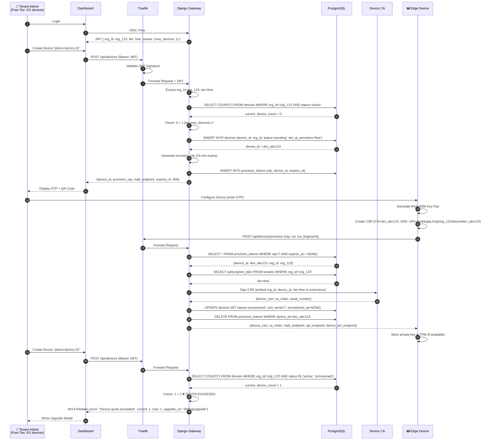

### **4.3 Feature Flag Enforcement Flow**

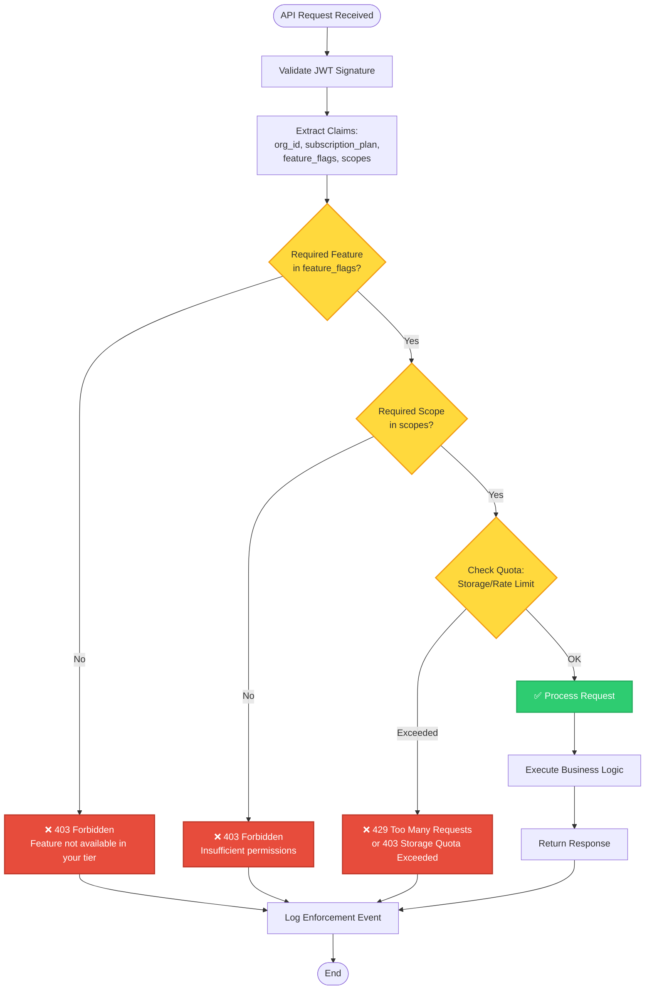

### **4.4 MinIO Multi-Tenant Bucket Architecture**

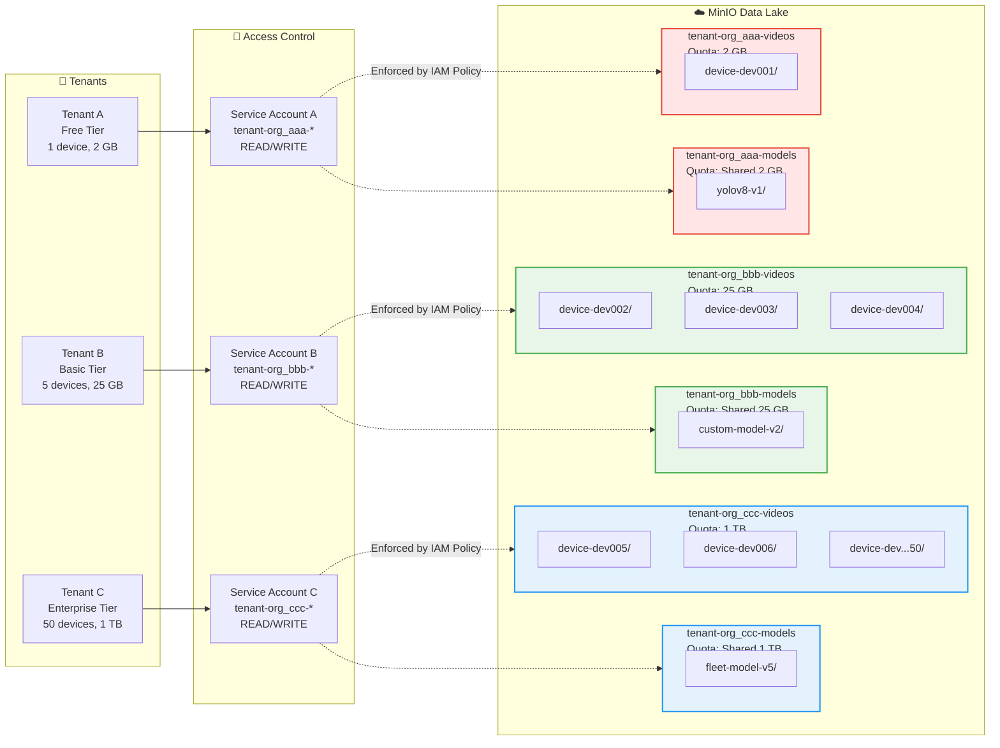

### **4.5 Tier Upgrade/Downgrade Flow**

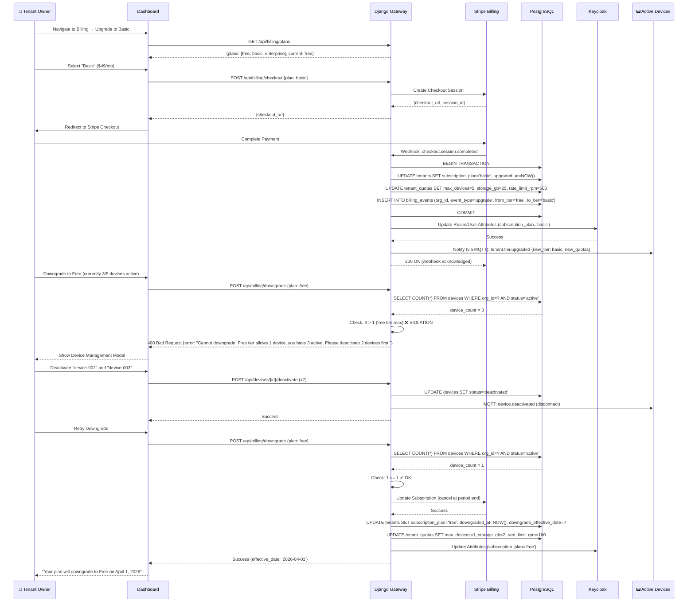

---

## **5. Data Structures & Schemas** {#5-data-structures--schemas}

### **5.1 Enhanced User JWT Structure**

```json
{
  "iss": "https://keycloak.meshlogiq.com/realms/meshlogiq",
  "sub": "user_550e8400-e29b-41d4-a716-446655440000",
  "typ": "user",
  "preferred_username": "alice.smith",
  "email": "alice.smith@acme-factory.com",
  "email_verified": true,
  
  "org_id": "org_772B3C4D5E6F",
  "org_name": "Acme Manufacturing",
  "subscription_plan": "basic",
  
  "roles": ["org:admin", "device:provision", "data:read", "data:write"],
  
  "feature_flags": {
    "fleet_management": false,
    "advanced_analytics": true,
    "custom_integrations": false,
    "webhook_automation": true,
    "audit_logging": false,
    "data_export": true,
    "model_registry": true,
    "ros2_integration": false,
    "sla_monitoring": false
  },
  
  "quotas": {
    "max_devices": 5,
    "storage_gb": 25,
    "rate_limit_rpm": 500,
    "concurrent_streams": 10,
    "api_calls_per_day": 100000
  },
  
  "iat": 1760000000,
  "exp": 1760003600,
  "nbf": 1760000000,
  "aud": ["meshlogiq-api", "meshlogiq-dashboard"]
}
```

### **5.2 Enhanced Device JWT Structure**

```json
{
  "iss": "https://keycloak.meshlogiq.com/realms/meshlogiq",
  "sub": "device_01H94T8Z2J3K4L5M6N7P8Q9R",
  "typ": "device",
  
  "device_id": "device_01H94T8Z2J3K4L5M6N7P8Q9R",
  "device_name": "jetson-factory-floor-01",
  "device_type": "jetson-orin-nx",
  "hw_fingerprint": "sha256:abc123...def456",
  
  "org_id": "org_772B3C4D5E6F",
  "subscription_plan": "basic",
  "tier_at_provision": "basic",
  
  "scopes": [
    "telemetry:write",
    "video:upload",
    "video:stream",
    "status:read",
    "status:write",
    "command:read",
    "ota:download"
  ],
  
  "feature_flags": {
    "advanced_analytics": true,
    "data_export": true,
    "model_registry": true
  },
  
  "quotas": {
    "rate_limit_rpm": 500,
    "max_video_upload_mb": 500,
    "storage_gb_shared": 25
  },
  
  "provisioned_at": "2026-03-01T10:30:00Z",
  "iat": 1760000000,
  "exp": 1760000300,
  "nbf": 1760000000,
  "aud": ["meshlogiq-api", "mqtt-broker"]
}
```

### **5.3 Device Certificate Structure (X.509)**

```
Certificate:
    Data:
        Version: 3 (0x2)
        Serial Number: 4d:3a:2c:1b:5e:6f:7a:8b
        Signature Algorithm: sha256WithRSAEncryption
        Issuer: CN=MeshLogIQ Device CA, O=MeshLogIQ, C=US
        Validity
            Not Before: Mar  1 10:30:00 2026 GMT
            Not After : Mar  1 10:30:00 2028 GMT
        Subject: CN=device_01H94T8Z2J3K4L5M6N7P8Q9R, O=MeshLogIQ
        Subject Public Key Info:
            Public Key Algorithm: rsaEncryption
                RSA Public-Key: (4096 bit)
        X509v3 extensions:
            X509v3 Key Usage: critical
                Digital Signature, Key Encipherment
            X509v3 Extended Key Usage: 
                TLS Web Client Authentication
            X509v3 Subject Alternative Name: 
                URI:meshlogiq://org/org_772B3C4D5E6F/device/device_01H94T8Z2J3K4L5M6N7P8Q9R
                DNS:device-01h94t8z2j3k4l5m6n7p8q9r.meshlogiq.local
            X509v3 Authority Key Identifier: 
                keyid:A1:B2:C3:D4:E5:F6:A7:B8:C9:D0:E1:F2:A3:B4:C5:D6:E7:F8:A9:B0
            X509v3 CRL Distribution Points: 
                Full Name:
                  URI:https://vault.meshlogiq.com/v1/pki/crl
            Authority Info Access: 
                OCSP - URI:https://vault.meshlogiq.com/v1/pki/ocsp
            1.3.6.1.4.1.99999.1 (Custom OID - MeshLogIQ Metadata): 
                org_id=org_772B3C4D5E6F
                device_id=device_01H94T8Z2J3K4L5M6N7P8Q9R
                subscription_plan=basic
                provisioned_at=2026-03-01T10:30:00Z
    Signature Algorithm: sha256WithRSAEncryption
```

### **5.4 PostgreSQL Schema**

#### **5.4.1 Tenants Table**

```sql
CREATE TABLE tenants (
    org_id VARCHAR(32) PRIMARY KEY,
    org_name VARCHAR(255) NOT NULL,
    subscription_plan VARCHAR(20) NOT NULL CHECK (subscription_plan IN ('free', 'basic', 'enterprise')),
    keycloak_realm VARCHAR(100) NOT NULL DEFAULT 'meshlogiq',
    
    -- Quota configuration
    max_devices INTEGER NOT NULL,
    storage_quota_gb INTEGER NOT NULL,
    rate_limit_rpm INTEGER NOT NULL,
    
    -- Current usage (cached from usage_metrics)
    current_device_count INTEGER NOT NULL DEFAULT 0,
    current_storage_gb NUMERIC(10, 2) NOT NULL DEFAULT 0,
    
    -- Feature flags
    feature_flags JSONB NOT NULL DEFAULT '{}',
    
    -- Billing
    stripe_customer_id VARCHAR(100),
    stripe_subscription_id VARCHAR(100),
    billing_email VARCHAR(255),
    
    -- Lifecycle
    created_at TIMESTAMP NOT NULL DEFAULT NOW(),
    upgraded_at TIMESTAMP,
    downgraded_at TIMESTAMP,
    downgrade_effective_date DATE,
    status VARCHAR(20) NOT NULL DEFAULT 'active' CHECK (status IN ('active', 'suspended', 'deleted')),
    
    -- Metadata
    metadata JSONB DEFAULT '{}',
    
    CONSTRAINT valid_quota CHECK (current_device_count <= max_devices)
);

CREATE INDEX idx_tenants_subscription_plan ON tenants(subscription_plan);
CREATE INDEX idx_tenants_stripe_customer ON tenants(stripe_customer_id);
```

#### **5.4.2 Devices Table**

```sql
CREATE TABLE devices (
    device_id VARCHAR(32) PRIMARY KEY,
    org_id VARCHAR(32) NOT NULL REFERENCES tenants(org_id) ON DELETE CASCADE,
    
    device_name VARCHAR(255) NOT NULL,
    device_type VARCHAR(50) NOT NULL,
    hw_fingerprint VARCHAR(255),
    
    -- Tier binding
    tier_at_provision VARCHAR(20) NOT NULL,
    current_tier VARCHAR(20) NOT NULL,
    
    -- Certificate details
    cert_serial_number VARCHAR(100),
    cert_issued_at TIMESTAMP,
    cert_expires_at TIMESTAMP,
    cert_revoked_at TIMESTAMP,
    
    -- Status
    status VARCHAR(20) NOT NULL DEFAULT 'pending' CHECK (status IN ('pending', 'provisioned', 'active', 'deactivated', 'revoked')),
    
    -- Timestamps
    created_at TIMESTAMP NOT NULL DEFAULT NOW(),
    provisioned_at TIMESTAMP,
    last_seen_at TIMESTAMP,
    
    -- Metadata
    metadata JSONB DEFAULT '{}',
    
    CONSTRAINT fk_tenant FOREIGN KEY (org_id) REFERENCES tenants(org_id)
);

CREATE INDEX idx_devices_org_id ON devices(org_id);
CREATE INDEX idx_devices_status ON devices(status);
CREATE INDEX idx_devices_org_status ON devices(org_id, status);
CREATE INDEX idx_devices_cert_serial ON devices(cert_serial_number);
```

#### **5.4.3 Users Table**

```sql
CREATE TABLE users (
    user_id VARCHAR(36) PRIMARY KEY,
    org_id VARCHAR(32) NOT NULL REFERENCES tenants(org_id) ON DELETE CASCADE,
    
    keycloak_user_id UUID NOT NULL UNIQUE,
    email VARCHAR(255) NOT NULL,
    username VARCHAR(100) NOT NULL,
    
    -- Roles (stored for audit; primary source is Keycloak)
    roles VARCHAR(20)[] NOT NULL DEFAULT ARRAY['viewer'],
    
    -- Status
    status VARCHAR(20) NOT NULL DEFAULT 'active' CHECK (status IN ('active', 'suspended', 'deleted')),
    
    -- Timestamps
    created_at TIMESTAMP NOT NULL DEFAULT NOW(),
    last_login_at TIMESTAMP,
    invited_by VARCHAR(36) REFERENCES users(user_id),
    
    CONSTRAINT unique_org_email UNIQUE (org_id, email)
);

CREATE INDEX idx_users_org_id ON users(org_id);
CREATE INDEX idx_users_keycloak_id ON users(keycloak_user_id);
```

#### **5.4.4 Provision Tokens Table**

```sql
CREATE TABLE provision_tokens (
    token_id SERIAL PRIMARY KEY,
    provision_otp VARCHAR(64) NOT NULL UNIQUE,
    device_id VARCHAR(32) NOT NULL REFERENCES devices(device_id) ON DELETE CASCADE,
    org_id VARCHAR(32) NOT NULL REFERENCES tenants(org_id) ON DELETE CASCADE,
    
    created_at TIMESTAMP NOT NULL DEFAULT NOW(),
    expires_at TIMESTAMP NOT NULL,
    used_at TIMESTAMP,
    
    CONSTRAINT valid_expiry CHECK (expires_at > created_at)
);

CREATE INDEX idx_provision_tokens_otp ON provision_tokens(provision_otp);
CREATE INDEX idx_provision_tokens_device ON provision_tokens(device_id);
CREATE INDEX idx_provision_tokens_expires ON provision_tokens(expires_at) WHERE used_at IS NULL;
```

#### **5.4.5 Storage Usage Table**

```sql
CREATE TABLE storage_usage (
    org_id VARCHAR(32) NOT NULL REFERENCES tenants(org_id) ON DELETE CASCADE,
    bucket_type VARCHAR(50) NOT NULL CHECK (bucket_type IN ('videos', 'models', 'telemetry', 'datasets')),
    
    usage_gb NUMERIC(10, 4) NOT NULL DEFAULT 0,
    object_count INTEGER NOT NULL DEFAULT 0,
    
    last_updated_at TIMESTAMP NOT NULL DEFAULT NOW(),
    
    PRIMARY KEY (org_id, bucket_type)
);

CREATE INDEX idx_storage_usage_org ON storage_usage(org_id);
```

#### **5.4.6 API Usage Metrics Table**

```sql
CREATE TABLE api_usage_metrics (
    metric_id SERIAL PRIMARY KEY,
    org_id VARCHAR(32) NOT NULL REFERENCES tenants(org_id) ON DELETE CASCADE,
    device_id VARCHAR(32) REFERENCES devices(device_id) ON DELETE SET NULL,
    user_id VARCHAR(36) REFERENCES users(user_id) ON DELETE SET NULL,
    
    endpoint VARCHAR(255) NOT NULL,
    method VARCHAR(10) NOT NULL,
    status_code INTEGER NOT NULL,
    
    timestamp TIMESTAMP NOT NULL DEFAULT NOW(),
    response_time_ms INTEGER,
    
    -- For rate limiting
    minute_bucket TIMESTAMP NOT NULL,
    
    CONSTRAINT identity_check CHECK (device_id IS NOT NULL OR user_id IS NOT NULL)
);

CREATE INDEX idx_api_usage_org_time ON api_usage_metrics(org_id, timestamp DESC);
CREATE INDEX idx_api_usage_minute_bucket ON api_usage_metrics(org_id, minute_bucket);
CREATE INDEX idx_api_usage_device ON api_usage_metrics(device_id, timestamp DESC);
```

### **5.5 Role Permission Matrix**

| Permission / Action | Owner | Admin | Developer | Operator | Viewer |
|---------------------|-------|-------|-----------|----------|--------|
| **Billing & Subscription** | | | | | |
| View billing details | ✅ | ✅ | ❌ | ❌ | ❌ |
| Upgrade/downgrade tier | ✅ | ❌ | ❌ | ❌ | ❌ |
| Manage payment methods | ✅ | ❌ | ❌ | ❌ | ❌ |
| View usage/quotas | ✅ | ✅ | ⚠️ Own only | ⚠️ Own only | ⚠️ Own only |
| **User Management** | | | | | |
| Invite users | ✅ | ✅ | ❌ | ❌ | ❌ |
| Assign roles | ✅ | ⚠️ Admin & below | ❌ | ❌ | ❌ |
| Remove users | ✅ | ✅ | ❌ | ❌ | ❌ |
| **Device Management** | | | | | |
| Provision devices | ✅ | ✅ | ✅ | ❌ | ❌ |
| Deactivate devices | ✅ | ✅ | ❌ | ❌ | ❌ |
| Revoke certificates | ✅ | ✅ | ❌ | ❌ | ❌ |
| View device list | ✅ | ✅ | ✅ | ✅ | ✅ |
| View device details | ✅ | ✅ | ✅ | ✅ | ✅ |
| Configure device settings | ✅ | ✅ | ✅ | ⚠️ Operational only | ❌ |
| **Data Access** | | | | | |
| View telemetry | ✅ | ✅ | ✅ | ✅ | ✅ |
| View videos | ✅ | ✅ | ✅ | ✅ | ✅ |
| Export data | ✅ | ✅ | ✅ | ❌ | ❌ |
| Delete data | ✅ | ✅ | ❌ | ❌ | ❌ |
| **Model & Analytics** | | | | | |
| View analytics | ✅ | ✅ | ✅ | ✅ | ✅ |
| Create/deploy models | ✅ | ✅ | ✅ | ❌ | ❌ |
| Configure pipelines | ✅ | ✅ | ✅ | ❌ | ❌ |
| **Integrations** | | | | | |
| Create webhooks | ✅ | ✅ | ✅ | ❌ | ❌ |
| Manage API keys | ✅ | ✅ | ✅ | ❌ | ❌ |
| Configure OAuth apps | ✅ | ✅ | ❌ | ❌ | ❌ |
| **System Settings** | | | | | |
| Organization settings | ✅ | ⚠️ Non-billing | ❌ | ❌ | ❌ |
| Audit log access | ✅ | ✅ | ❌ | ❌ | ❌ |

**Legend:**
- ✅ Full access
- ❌ No access
- ⚠️ Conditional/limited access

### **5.6 MinIO Bucket Naming & Structure**

```
MinIO Root
├── tenant-{org_id}-videos/
│   ├── device-{device_id}/
│   │   ├── 2026/03/01/
│   │   │   ├── raw/
│   │   │   │   ├── video_20260301_100000.mp4
│   │   │   │   └── video_20260301_100015.mp4
│   │   │   ├── processed/
│   │   │   │   ├── inference_20260301_100000.mp4
│   │   │   │   └── inference_20260301_100000.json (metadata)
│   │   │   └── clips/
│   │   │       ├── anomaly_clip_001.mp4
│   │   │       └── anomaly_clip_001.json
│   │   └── ...
│   └── _metadata/
│       └── usage.json (cached bucket usage stats)
│
├── tenant-{org_id}-models/
│   ├── yolov8-custom-factory-v1/
│   │   ├── model.onnx
│   │   ├── config.yaml
│   │   ├── labels.txt
│   │   └── metadata.json
│   ├── yolov8-custom-factory-v2/
│   └── ...
│
├── tenant-{org_id}-telemetry/
│   ├── 2026/03/
│   │   ├── daily-aggregates/
│   │   │   ├── 2026-03-01.parquet
│   │   │   └── 2026-03-02.parquet
│   │   └── raw-events/
│   │       ├── device-{device_id}/
│   │       │   ├── 2026-03-01-00.json.gz
│   │       │   └── 2026-03-01-01.json.gz
│   └── ...
│
└── tenant-{org_id}-datasets/
    ├── training/
    │   ├── dataset_v1/
    │   │   ├── images/
    │   │   ├── annotations/
    │   │   └── manifest.json
    └── exports/
        ├── export_20260301_telemetry.csv
        └── export_20260301_telemetry.parquet
```

---

## **6. Enforcement Points** {#6-enforcement-points}

### **6.1 Enforcement Layer Overview**

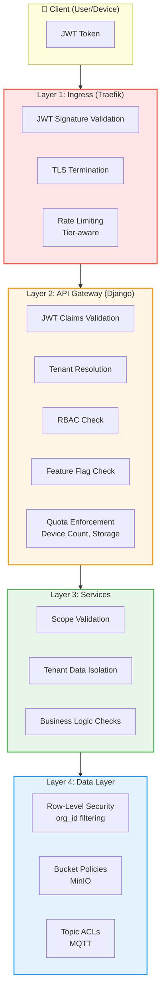

### **6.2 Detailed Enforcement Matrix**

| Enforcement Point | What is Enforced | How | When | Rejection Response |
|-------------------|------------------|-----|------|-------------------|
| **Keycloak** | Password authentication, MFA, account lockout | Internal Keycloak policies | Login time | 401 Unauthorized |
| **Keycloak** | Token claims enrichment (tier, quotas, features) | Custom claim mapper queries PostgreSQL | Token issuance | N/A (transparent) |
| **Keycloak** | Token expiration | JWT `exp` claim | Every token issuance | N/A |
| **Traefik** | JWT signature validation | JWKS public key from Keycloak | Every HTTP request | 401 Unauthorized (invalid signature) |
| **Traefik** | TLS certificate validation (devices) | mTLS handshake | MQTT/HTTPS connection | Connection refused |
| **Traefik** | Rate limiting (tier-aware) | Redis-backed rate limiter | Every HTTP request | 429 Too Many Requests |
| **Django Gateway** | JWT expiration & issuer | Validate `exp`, `iss`, `aud` claims | Every API request | 401 Unauthorized (expired token) |
| **Django Gateway** | Tenant resolution | Extract `org_id` from JWT | Every API request | 403 Forbidden (invalid tenant) |
| **Django Gateway** | RBAC (role-based access) | Check `roles` claim against endpoint requirements | Every API request | 403 Forbidden (insufficient role) |
| **Django Gateway** | Feature flags | Check `feature_flags` claim against required feature | Feature-gated endpoints | 403 Forbidden (feature not available in tier) |
| **Django Gateway** | Device quota | Query device count vs. `quotas.max_devices` | Device provisioning | 403 Forbidden (device quota exceeded) |
| **Django Gateway** | Storage quota | Query storage usage vs. `quotas.storage_gb` | Video/model upload | 403 Forbidden (storage quota exceeded) |
| **Django Gateway** | Provisioning token validation | Validate OTP, expiry, unused status | Device provisioning | 403 Forbidden (invalid OTP) |
| **FastAPI Services** | Scope validation | Check `scopes` claim against required scope | Every service request | 403 Forbidden (insufficient scope) |
| **FastAPI Services** | Tenant data isolation | Filter all DB queries by `org_id` | Every data access | Empty result set (data not found) |
| **FastAPI Services** | Feature-specific logic | Check `feature_flags` before executing | Feature execution | 403 Forbidden or graceful degradation |
| **PostgreSQL** | Row-level security | `org_id` column filtering | Every query | Empty result set |
| **MinIO** | Bucket access control | IAM policies per tenant service account | Every S3 operation | 403 AccessDenied |
| **MinIO** | Storage quotas | Bucket quota limits | Object PUT operations | 403 QuotaExceeded |
| **MQTT Broker** | mTLS authentication | Certificate chain validation | MQTT CONNECT | CONNACK refused |
| **MQTT Broker** | Topic ACLs | Pattern matching: `telemetry/{org_id}/{device_id}/#` | PUBLISH/SUBSCRIBE | PUBACK/SUBACK refused |
| **MQTT Broker** | Rate limiting | Message count per minute (tier-based) | Every PUBLISH | Disconnect on violation |
| **Device CA** | Certificate issuance | Validate provisioning workflow | CSR signing | Certificate not issued |
| **Device CA** | Certificate revocation | CRL/OCSP checks | mTLS handshake | Certificate validation failed |

### **6.3 Tier-Specific Enforcement Logic**

#### **6.3.1 Device Provisioning Enforcement**

```python
# Django API Gateway: /api/devices (POST)

def provision_device(request):
    # Step 1: Validate JWT
    jwt_payload = validate_jwt(request.headers['Authorization'])
    org_id = jwt_payload['org_id']
    subscription_plan = jwt_payload['subscription_plan']
    max_devices = jwt_payload['quotas']['max_devices']
    
    # Step 2: Check current device count
    current_count = Device.objects.filter(
        org_id=org_id,
        status__in=['active', 'provisioned']
    ).count()
    
    # Step 3: Enforce quota
    if current_count >= max_devices:
        return Response({
            'error': 'device_quota_exceeded',
            'message': f'Your {subscription_plan} tier allows {max_devices} device(s). You currently have {current_count}.',
            'current': current_count,
            'max': max_devices,
            'upgrade_url': '/billing/upgrade'
        }, status=403)
    
    # Step 4: Create device record
    device = Device.objects.create(
        org_id=org_id,
        device_name=request.data['device_name'],
        tier_at_provision=subscription_plan,
        status='pending'
    )
    
    # Step 5: Generate provision token
    provision_otp = generate_otp()
    ProvisionToken.objects.create(
        provision_otp=provision_otp,
        device_id=device.device_id,
        org_id=org_id,
        expires_at=now() + timedelta(minutes=15)
    )
    
    return Response({
        'device_id': device.device_id,
        'provision_otp': provision_otp,
        'expires_in': 900
    }, status=201)
```

#### **6.3.2 Storage Upload Enforcement**

```python
# Video Service: /api/video/upload (POST)

def upload_video(request):
    # Step 1: Validate JWT
    jwt_payload = validate_jwt(request.headers['Authorization'])
    org_id = jwt_payload['org_id']
    storage_quota_gb = jwt_payload['quotas']['storage_gb']
    
    # Step 2: Check current storage usage
    current_usage_gb = get_storage_usage(org_id)  # Cached in Redis
    
    # Step 3: Check file size
    file_size_mb = int(request.headers['Content-Length']) / 1024 / 1024
    file_size_gb = file_size_mb / 1024
    
    # Step 4: Enforce quota
    if current_usage_gb + file_size_gb > storage_quota_gb:
        return Response({
            'error': 'storage_quota_exceeded',
            'message': f'Upload would exceed your storage quota.',
            'current_usage_gb': current_usage_gb,
            'quota_gb': storage_quota_gb,
            'file_size_gb': file_size_gb,
            'available_gb': storage_quota_gb - current_usage_gb,
            'upgrade_url': '/billing/upgrade'
        }, status=403)
    
    # Step 5: Generate signed upload URL
    bucket_name = f"tenant-{org_id}-videos"
    object_key = f"device-{jwt_payload['device_id']}/{datetime.now().strftime('%Y/%m/%d')}/raw/{uuid.uuid4()}.mp4"
    
    upload_url = minio_client.presigned_put_object(
        bucket_name,
        object_key,
        expires=timedelta(minutes=15)
    )
    
    return Response({
        'upload_url': upload_url,
        'object_key': object_key,
        'expires_in': 900
    }, status=200)
```

#### **6.3.3 Feature Flag Enforcement**

```python
# Django Middleware: Feature Gate Decorator

def require_feature(feature_name):
    def decorator(view_func):
        @wraps(view_func)
        def wrapper(request, *args, **kwargs):
            jwt_payload = request.jwt_payload  # Set by auth middleware
            feature_flags = jwt_payload.get('feature_flags', {})
            
            if not feature_flags.get(feature_name, False):
                subscription_plan = jwt_payload.get('subscription_plan', 'unknown')
                return Response({
                    'error': 'feature_not_available',
                    'message': f'The "{feature_name}" feature is not available in your {subscription_plan} tier.',
                    'required_tiers': get_feature_tiers(feature_name),
                    'upgrade_url': '/billing/upgrade'
                }, status=403)
            
            return view_func(request, *args, **kwargs)
        return wrapper
    return decorator

# Usage:
@require_feature('fleet_management')
def fleet_dashboard(request):
    # Only accessible to Enterprise tier
    return Response({'fleet_data': ...})
```

#### **6.3.4 Rate Limiting Enforcement (Traefik)**

```yaml
# Traefik dynamic configuration (traefik-dynamic.yml)

http:
  middlewares:
    rate-limit-free:
      rateLimit:
        average: 100  # requests per minute
        burst: 20
        sourceCriterion:
          requestHeaderName: X-Tenant-ID
    
    rate-limit-basic:
      rateLimit:
        average: 500
        burst: 100
        sourceCriterion:
          requestHeaderName: X-Tenant-ID
    
    rate-limit-enterprise:
      rateLimit:
        average: 10000  # effectively unlimited
        burst: 1000
        sourceCriterion:
          requestHeaderName: X-Tenant-ID
    
    jwt-auth:
      plugin:
        jwt-plugin:
          jwksUrl: "https://keycloak.meshlogiq.com/realms/meshlogiq/protocol/openid-connect/certs"
          forwardHeaders:
            - X-Tenant-ID  # Extract from JWT org_id claim
            - X-Subscription-Plan

  routers:
    api-router:
      rule: "PathPrefix(`/api`)"
      service: django-gateway
      middlewares:
        - jwt-auth
        - rate-limit-by-tier  # Dynamic middleware selection based on X-Subscription-Plan
      tls:
        certResolver: letsencrypt
```

#### **6.3.5 MQTT Topic ACL Enforcement (EMQX)**

```erlang
%% EMQX ACL rules (emqx_acl.conf)

%% Rule 1: Allow devices to publish to their own telemetry topic
{allow, {client, "${client_org_id}"}, publish, ["telemetry/${client_org_id}/${client_device_id}/#"]}.

%% Rule 2: Allow devices to subscribe to their own command topic
{allow, {client, "${client_org_id}"}, subscribe, ["command/${client_org_id}/${client_device_id}/#"]}.

%% Rule 3: Deny all other topics
{deny, all}.

%% Rate limiting plugin configuration
plugin.emqx_rate_limiter.client.free.rate = 100/m
plugin.emqx_rate_limiter.client.basic.rate = 500/m
plugin.emqx_rate_limiter.client.enterprise.rate = unlimited

%% Extract org_id and tier from certificate custom extension
auth.mqtt.tls.client_cert_parse = true
auth.mqtt.tls.client_cert_extract = cn, san, custom_extensions
```

---

## **7. References** {#7-references}

1. **Keycloak Documentation**  
   <https://www.keycloak.org/documentation>

2. **OAuth 2.0 Client Credentials Grant**  
   <https://datatracker.ietf.org/doc/html/rfc6749#section-4.4>

3. **JWT Best Practices (RFC 8725)**  
   <https://datatracker.ietf.org/doc/html/rfc8725>

4. **mTLS Authentication for IoT**  
   <https://www.cloudflare.com/learning/ssl/transport-layer-security-tls/>

5. **MQTT Security Best Practices**  
   <https://www.hivemq.com/blog/mqtt-security-fundamentals/>

6. **EMQX Authentication & ACL**  
   <https://www.emqx.io/docs/en/v5.0/security/authn/authn.html>

7. **HashiCorp Vault PKI Secrets Engine**  
   <https://developer.hashicorp.com/vault/docs/secrets/pki>

8. **MinIO Multi-Tenancy Guide**  
   <https://min.io/docs/minio/linux/administration/identity-access-management/multi-tenancy.html>

9. **PostgreSQL Row-Level Security**  
   <https://www.postgresql.org/docs/current/ddl-rowsecurity.html>

10. **Traefik Rate Limiting Middleware**  
    <https://doc.traefik.io/traefik/middlewares/http/ratelimit/>

11. **Stripe Subscription API**  
    <https://stripe.com/docs/billing/subscriptions/overview>

12. **X.509 Certificate Extensions**  
    <https://datatracker.ietf.org/doc/html/rfc5280#section-4.2>

---

## **8. Tier Management & Billing Integration** {#8-tier-management--billing-integration}

### **8.1 Subscription Lifecycle**

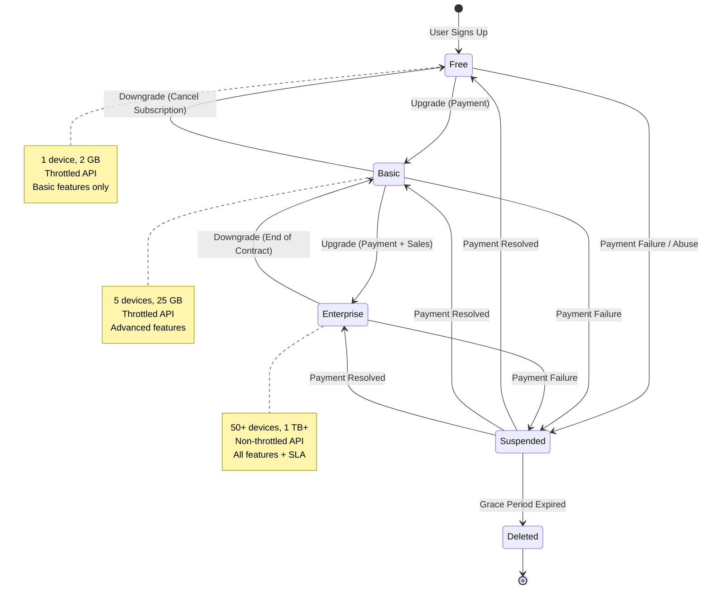

### **8.2 Tier Upgrade Flow**

#### **8.2.1 User-Initiated Upgrade (Free → Basic)**

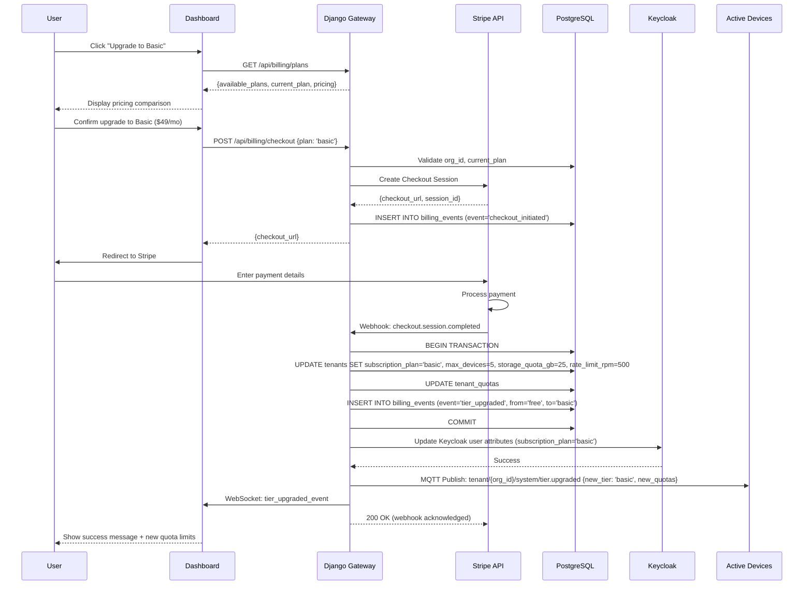

#### **8.2.2 Enterprise Sales-Led Upgrade**

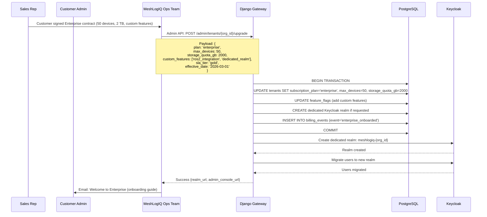

### **8.3 Tier Downgrade Flow**

#### **8.3.1 Quota Violation Detection**

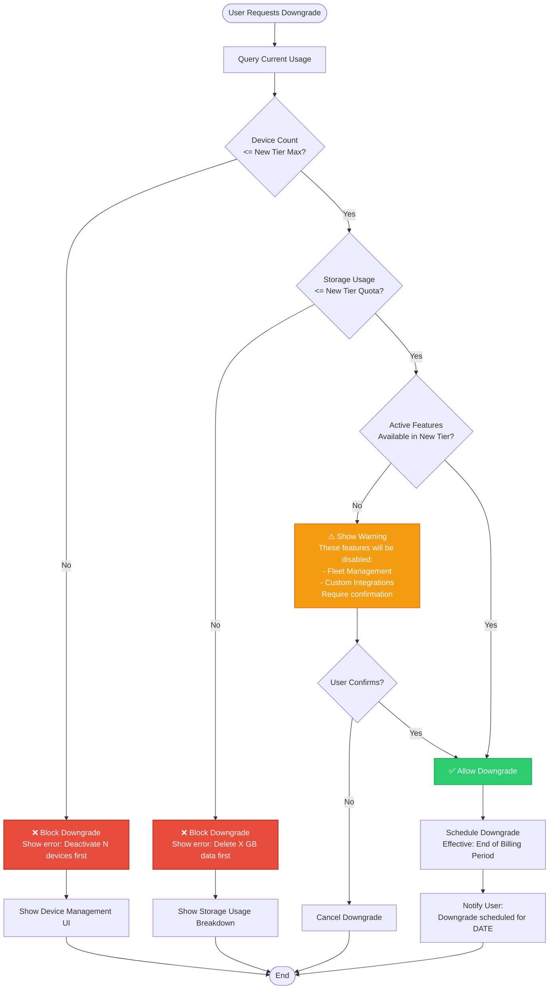

#### **8.3.2 Downgrade Execution**

```python
# Scheduled Job: Execute pending downgrades

def execute_downgrades():
    today = datetime.now().date()
    
    # Get all tenants with scheduled downgrades
    downgrades = Tenant.objects.filter(
        downgrade_effective_date=today,
        status='active'
    )
    
    for tenant in downgrades:
        old_plan = tenant.subscription_plan
        new_plan = tenant.pending_downgrade_plan
        
        # Pre-flight checks (should have been validated at downgrade request)
        device_count = Device.objects.filter(org_id=tenant.org_id, status='active').count()
        new_max_devices = TIER_CONFIGS[new_plan]['max_devices']
        
        if device_count > new_max_devices:
            # Emergency: Force-deactivate devices (prioritize oldest provisioned)
            excess_devices = Device.objects.filter(
                org_id=tenant.org_id,
                status='active'
            ).order_by('provisioned_at')[new_max_devices:]
            
            for device in excess_devices:
                device.status = 'deactivated'
                device.deactivated_reason = 'tier_downgrade_quota_enforcement'
                device.save()
                
                # Notify device via MQTT
                mqtt_publish(
                    f"command/{tenant.org_id}/{device.device_id}/system",
                    {"command": "disconnect", "reason": "tier_downgrade"}
                )
        
        # Update tenant tier
        tenant.subscription_plan = new_plan
        tenant.max_devices = TIER_CONFIGS[new_plan]['max_devices']
        tenant.storage_quota_gb = TIER_CONFIGS[new_plan]['storage_gb']
        tenant.rate_limit_rpm = TIER_CONFIGS[new_plan]['rate_limit_rpm']
        tenant.feature_flags = TIER_CONFIGS[new_plan]['default_features']
        tenant.downgraded_at = datetime.now()
        tenant.downgrade_effective_date = None
        tenant.pending_downgrade_plan = None
        tenant.save()
        
        # Update Keycloak
        update_keycloak_user_attributes(tenant.org_id, new_plan)
        
        # Log event
        BillingEvent.objects.create(
            org_id=tenant.org_id,
            event_type='tier_downgraded',
            from_tier=old_plan,
            to_tier=new_plan,
            metadata={'device_count': device_count, 'deactivated_devices': len(excess_devices)}
        )
        
        # Notify tenant owner
        send_email(
            to=tenant.billing_email,
            subject=f"Your MeshLogIQ plan has been downgraded to {new_plan.capitalize()}",
            template='tier_downgraded',
            context={'old_plan': old_plan, 'new_plan': new_plan, 'new_quotas': TIER_CONFIGS[new_plan]}
        )
```

### **8.4 Device Metering & Billing Hooks**

#### **8.4.1 Usage Tracking**

```python
# Background job: Update usage metrics (runs every 15 minutes)

def update_usage_metrics():
    tenants = Tenant.objects.filter(status='active')
    
    for tenant in tenants:
        # Device count
        device_count = Device.objects.filter(
            org_id=tenant.org_id,
            status__in=['active', 'provisioned']
        ).count()
        
        # Storage usage (aggregate from MinIO)
        storage_usage_gb = 0
        for bucket_type in ['videos', 'models', 'telemetry', 'datasets']:
            bucket_name = f"tenant-{tenant.org_id}-{bucket_type}"
            try:
                bucket_stats = minio_client.bucket_stats(bucket_name)
                storage_usage_gb += bucket_stats['size'] / 1024 / 1024 / 1024
            except:
                pass
        
        # API usage (last hour)
        api_calls_last_hour = APIUsageMetric.objects.filter(
            org_id=tenant.org_id,
            timestamp__gte=datetime.now() - timedelta(hours=1)
        ).count()
        
        # Update cached metrics
        tenant.current_device_count = device_count
        tenant.current_storage_gb = storage_usage_gb
        tenant.save()
        
        # Cache in Redis for fast access
        redis_client.hset(
            f"tenant:{tenant.org_id}:usage",
            mapping={
                'device_count': device_count,
                'storage_gb': storage_usage_gb,
                'api_calls_last_hour': api_calls_last_hour,
                'updated_at': datetime.now().isoformat()
            }
        )
        
        # Check for quota violations
        if device_count > tenant.max_devices:
            alert_quota_violation(tenant, 'device_count', device_count, tenant.max_devices)
        
        if storage_usage_gb > tenant.storage_quota_gb:
            alert_quota_violation(tenant, 'storage', storage_usage_gb, tenant.storage_quota_gb)
```

#### **8.4.2 Metered Billing (Enterprise Usage-Based)**

```python
# For Enterprise tiers with usage-based billing

def calculate_monthly_usage_charges(org_id, billing_period_start, billing_period_end):
    tenant = Tenant.objects.get(org_id=org_id)
    
    if tenant.subscription_plan != 'enterprise':
        return None
    
    charges = {
        'base_fee': tenant.enterprise_base_fee,
        'overages': {}
    }
    
    # Device overage (e.g., $10/device/month over base 50)
    base_devices = 50
    avg_device_count = DeviceMetric.objects.filter(
        org_id=org_id,
        timestamp__range=(billing_period_start, billing_period_end)
    ).aggregate(Avg('device_count'))['device_count__avg']
    
    if avg_device_count > base_devices:
        device_overage = math.ceil(avg_device_count - base_devices)
        charges['overages']['devices'] = {
            'quantity': device_overage,
            'unit_price': 10,
            'total': device_overage * 10
        }
    
    # Storage overage (e.g., $0.10/GB/month over base 1 TB)
    base_storage_gb = 1024
    avg_storage_gb = StorageMetric.objects.filter(
        org_id=org_id,
        timestamp__range=(billing_period_start, billing_period_end)
    ).aggregate(Avg('storage_gb'))['storage_gb__avg']
    
    if avg_storage_gb > base_storage_gb:
        storage_overage = math.ceil(avg_storage_gb - base_storage_gb)
        charges['overages']['storage'] = {
            'quantity': storage_overage,
            'unit_price': 0.10,
            'total': storage_overage * 0.10
        }
    
    # API call overage (e.g., $0.0001 per call over 10M/month)
    base_api_calls = 10_000_000
    total_api_calls = APIUsageMetric.objects.filter(
        org_id=org_id,
        timestamp__range=(billing_period_start, billing_period_end)
    ).count()
    
    if total_api_calls > base_api_calls:
        api_overage = total_api_calls - base_api_calls
        charges['overages']['api_calls'] = {
            'quantity': api_overage,
            'unit_price': 0.0001,
            'total': api_overage * 0.0001
        }
    
    charges['total'] = charges['base_fee'] + sum(
        overage['total'] for overage in charges['overages'].values()
    )
    
    return charges
```

#### **8.4.3 Stripe Integration**

```python
# Webhook handler for Stripe events

@csrf_exempt
def stripe_webhook(request):
    payload = request.body
    sig_header = request.META['HTTP_STRIPE_SIGNATURE']
    
    try:
        event = stripe.Webhook.construct_event(
            payload, sig_header, settings.STRIPE_WEBHOOK_SECRET
        )
    except ValueError:
        return HttpResponse(status=400)
    except stripe.error.SignatureVerificationError:
        return HttpResponse(status=400)
    
    # Handle different event types
    if event['type'] == 'checkout.session.completed':
        session = event['data']['object']
        org_id = session['metadata']['org_id']
        new_plan = session['metadata']['plan']
        
        # Upgrade tenant
        tenant = Tenant.objects.get(org_id=org_id)
        old_plan = tenant.subscription_plan
        
        tenant.subscription_plan = new_plan
        tenant.stripe_subscription_id = session['subscription']
        tenant.max_devices = TIER_CONFIGS[new_plan]['max_devices']
        tenant.storage_quota_gb = TIER_CONFIGS[new_plan]['storage_gb']
        tenant.rate_limit_rpm = TIER_CONFIGS[new_plan]['rate_limit_rpm']
        tenant.feature_flags = TIER_CONFIGS[new_plan]['default_features']
        tenant.upgraded_at = datetime.now()
        tenant.save()
        
        # Update Keycloak
        update_keycloak_user_attributes(org_id, new_plan)
        
        # Log event
        BillingEvent.objects.create(
            org_id=org_id,
            event_type='tier_upgraded',
            from_tier=old_plan,
            to_tier=new_plan,
            stripe_event_id=event['id']
        )
        
    elif event['type'] == 'customer.subscription.deleted':
        subscription = event['data']['object']
        tenant = Tenant.objects.get(stripe_subscription_id=subscription['id'])
        
        # Downgrade to free tier
        tenant.subscription_plan = 'free'
        tenant.downgraded_at = datetime.now()
        tenant.save()
        
        # Enforce free tier quotas immediately
        enforce_free_tier_quotas(tenant.org_id)
    
    elif event['type'] == 'invoice.payment_failed':
        invoice = event['data']['object']
        tenant = Tenant.objects.get(stripe_customer_id=invoice['customer'])
        
        # Suspend tenant after 3 failed payments
        failed_payments = BillingEvent.objects.filter(
            org_id=tenant.org_id,
            event_type='payment_failed',
            created_at__gte=datetime.now() - timedelta(days=30)
        ).count()
        
        if failed_payments >= 3:
            tenant.status = 'suspended'
            tenant.save()
            
            # Disconnect all devices
            devices = Device.objects.filter(org_id=tenant.org_id, status='active')
            for device in devices:
                mqtt_publish(
                    f"command/{tenant.org_id}/{device.device_id}/system",
                    {"command": "disconnect", "reason": "account_suspended"}
                )
    
    return HttpResponse(status=200)
```

### **8.5 Storage Quota Monitoring**

#### **8.5.1 Real-Time Storage Tracking**

```python
# MinIO event listener (using MinIO webhook notifications)

def handle_minio_event(event):
    """
    Called when objects are PUT or DELETE in MinIO buckets
    """
    bucket_name = event['Records'][0]['s3']['bucket']['name']
    object_key = event['Records'][0]['s3']['object']['key']
    object_size = event['Records'][0]['s3']['object']['size']
    event_name = event['Records'][0]['eventName']
    
    # Extract org_id from bucket name (tenant-{org_id}-videos)
    match = re.match(r'tenant-([a-zA-Z0-9_]+)-', bucket_name)
    if not match:
        return
    
    org_id = match.group(1)
    tenant = Tenant.objects.get(org_id=org_id)
    
    # Update storage usage
    if event_name.startswith('s3:ObjectCreated:'):
        tenant.current_storage_gb += object_size / 1024 / 1024 / 1024
    elif event_name.startswith('s3:ObjectRemoved:'):
        tenant.current_storage_gb -= object_size / 1024 / 1024 / 1024
    
    tenant.save()
    
    # Check quota
    if tenant.current_storage_gb > tenant.storage_quota_gb:
        # Alert tenant
        alert_quota_exceeded(tenant, 'storage')
        
        # Optionally: Block new uploads (set flag in Redis)
        redis_client.set(f"tenant:{org_id}:storage_blocked", "1", ex=3600)
```

#### **8.5.2 Lifecycle Policies (Tier-Based)**

```python
# Configure MinIO lifecycle policies based on tier

def configure_bucket_lifecycle(org_id, subscription_plan):
    lifecycle_config = {
        'free': {
            'videos': {'expiration_days': 30},
            'telemetry': {'expiration_days': 7},
            'models': {'expiration_days': 90}
        },
        'basic': {
            'videos': {'expiration_days': 90},
            'telemetry': {'expiration_days': 30},
            'models': {'expiration_days': 365}
        },
        'enterprise': {
            'videos': {'expiration_days': 365},
            'telemetry': {'expiration_days': 180},
            'models': None  # No expiration
        }
    }
    
    tier_config = lifecycle_config[subscription_plan]
    
    for bucket_type, policy in tier_config.items():
        if policy is None:
            continue
        
        bucket_name = f"tenant-{org_id}-{bucket_type}"
        
        minio_client.set_bucket_lifecycle(
            bucket_name,
            LifecycleConfig([
                Rule(
                    rule_id=f"expire-{bucket_type}",
                    status='Enabled',
                    expiration=Expiration(days=policy['expiration_days'])
                )
            ])
        )
```

### **8.6 API Rate Limiting Implementation**

#### **8.6.1 Redis-Based Token Bucket**

```python
# Middleware: Rate limit enforcement

class RateLimitMiddleware:
    def __init__(self, get_response):
        self.get_response = get_response
        self.redis_client = redis.StrictRedis(host='localhost', port=6379, db=0)
    
    def __call__(self, request):
        if request.path.startswith('/api/'):
            jwt_payload = request.jwt_payload  # Set by auth middleware
            org_id = jwt_payload['org_id']
            rate_limit_rpm = jwt_payload['quotas']['rate_limit_rpm']
            
            # Token bucket key
            current_minute = datetime.now().replace(second=0, microsecond=0)
            key = f"ratelimit:{org_id}:{current_minute.isoformat()}"
            
            # Increment request count
            current_count = self.redis_client.incr(key)
            
            # Set expiry on first request of this minute
            if current_count == 1:
                self.redis_client.expire(key, 60)
            
            # Check limit
            if current_count > rate_limit_rpm:
                return JsonResponse({
                    'error': 'rate_limit_exceeded',
                    'message': f'Your tier allows {rate_limit_rpm} requests per minute.',
                    'limit': rate_limit_rpm,
                    'current': current_count,
                    'reset_at': (current_minute + timedelta(minutes=1)).isoformat(),
                    'upgrade_url': '/billing/upgrade'
                }, status=429, headers={
                    'X-RateLimit-Limit': str(rate_limit_rpm),
                    'X-RateLimit-Remaining': '0',
                    'X-RateLimit-Reset': str(int((current_minute + timedelta(minutes=1)).timestamp()))
                })
            
            # Add rate limit headers
            response = self.get_response(request)
            response['X-RateLimit-Limit'] = str(rate_limit_rpm)
            response['X-RateLimit-Remaining'] = str(rate_limit_rpm - current_count)
            response['X-RateLimit-Reset'] = str(int((current_minute + timedelta(minutes=1)).timestamp()))
            
            return response
        
        return self.get_response(request)
```

#### **8.6.2 Sliding Window Rate Limiter (Alternative)**

```python
# More accurate sliding window algorithm

def check_rate_limit_sliding_window(org_id, rate_limit_rpm):
    redis_client = get_redis_client()
    now = datetime.now()
    window_start = now - timedelta(minutes=1)
    
    # Sorted set key (score = timestamp, value = request_id)
    key = f"ratelimit:sliding:{org_id}"
    
    # Remove old entries outside the window
    redis_client.zremrangebyscore(key, 0, window_start.timestamp())
    
    # Count requests in current window
    current_count = redis_client.zcard(key)
    
    if current_count >= rate_limit_rpm:
        # Get oldest request timestamp for reset calculation
        oldest_request = redis_client.zrange(key, 0, 0, withscores=True)
        if oldest_request:
            reset_at = datetime.fromtimestamp(oldest_request[0][1]) + timedelta(minutes=1)
        else:
            reset_at = now + timedelta(minutes=1)
        
        return False, {
            'limit': rate_limit_rpm,
            'remaining': 0,
            'reset_at': reset_at
        }
    
    # Add current request
    request_id = str(uuid.uuid4())
    redis_client.zadd(key, {request_id: now.timestamp()})
    redis_client.expire(key, 60)
    
    return True, {
        'limit': rate_limit_rpm,
        'remaining': rate_limit_rpm - current_count - 1,
        'reset_at': now + timedelta(minutes=1)
    }
```

### **8.7 Monitoring & Alerting**

#### **8.7.1 Quota Alert System**

```python
# Alert system for quota violations

def alert_quota_violation(tenant, quota_type, current_value, max_value):
    """
    Send alerts when quotas are exceeded or approaching limits
    """
    utilization_pct = (current_value / max_value) * 100
    
    # Define alert thresholds
    if utilization_pct >= 100:
        severity = 'critical'
        message = f"QUOTA EXCEEDED: {quota_type}"
    elif utilization_pct >= 90:
        severity = 'warning'
        message = f"QUOTA WARNING: {quota_type} at {utilization_pct:.1f}%"
    elif utilization_pct >= 80:
        severity = 'info'
        message = f"QUOTA NOTICE: {quota_type} at {utilization_pct:.1f}%"
    else:
        return  # No alert needed
    
    # Send email to tenant owner
    send_email(
        to=tenant.billing_email,
        subject=f"MeshLogIQ: {message}",
        template='quota_alert',
        context={
            'tenant': tenant,
            'quota_type': quota_type,
            'current_value': current_value,
            'max_value': max_value,
            'utilization_pct': utilization_pct,
            'severity': severity,
            'upgrade_url': f"https://app.meshlogiq.com/billing/upgrade?org_id={tenant.org_id}"
        }
    )
    
    # Log alert
    Alert.objects.create(
        org_id=tenant.org_id,
        alert_type='quota_violation',
        severity=severity,
        message=message,
        metadata={
            'quota_type': quota_type,
            'current_value': current_value,
            'max_value': max_value,
            'utilization_pct': utilization_pct
        }
    )
    
    # If critical, also notify via Slack/PagerDuty (for Enterprise)
    if severity == 'critical' and tenant.subscription_plan == 'enterprise':
        notify_slack(
            channel=f"#alerts-{tenant.org_id}",
            message=f"🚨 {message} for {tenant.org_name}",
            severity='critical'
        )
```

#### **8.7.2 Usage Dashboard Metrics**

```python
# API endpoint for usage dashboard

@require_role('owner', 'admin')
def get_usage_metrics(request):
    org_id = request.jwt_payload['org_id']
    tenant = Tenant.objects.get(org_id=org_id)
    
    # Device metrics
    device_count = Device.objects.filter(org_id=org_id, status='active').count()
    device_utilization = (device_count / tenant.max_devices) * 100
    
    # Storage metrics
    storage_usage_gb = tenant.current_storage_gb
    storage_utilization = (storage_usage_gb / tenant.storage_quota_gb) * 100
    
    storage_by_type = StorageUsage.objects.filter(org_id=org_id).values('bucket_type', 'usage_gb')
    
    # API usage (last 30 days)
    thirty_days_ago = datetime.now() - timedelta(days=30)
    api_usage = APIUsageMetric.objects.filter(
        org_id=org_id,
        timestamp__gte=thirty_days_ago
    ).extra({'date': "DATE(timestamp)"}).values('date').annotate(
        request_count=Count('metric_id'),
        avg_response_time=Avg('response_time_ms')
    ).order_by('date')
    
    # Feature usage
    feature_usage = {}
    for feature, enabled in tenant.feature_flags.items():
        if enabled:
            # Count usage of feature-specific endpoints
            feature_usage[feature] = APIUsageMetric.objects.filter(
                org_id=org_id,
                endpoint__contains=feature.replace('_', '-'),
                timestamp__gte=thirty_days_ago
            ).count()
    
    return JsonResponse({
        'subscription_plan': tenant.subscription_plan,
        'quotas': {
            'devices': {
                'current': device_count,
                'max': tenant.max_devices,
                'utilization_pct': device_utilization
            },
            'storage': {
                'current_gb': storage_usage_gb,
                'max_gb': tenant.storage_quota_gb,
                'utilization_pct': storage_utilization,
                'breakdown': list(storage_by_type)
            },
            'rate_limit': {
                'rpm': tenant.rate_limit_rpm
            }
        },
        'api_usage': list(api_usage),
        'feature_usage': feature_usage,
        'billing_period': {
            'start': tenant.current_billing_period_start,
            'end': tenant.current_billing_period_end
        }
    })
```

---

## **Appendix A: Tier Comparison Table**

| Feature / Quota | Free Tier | Basic Tier | Enterprise Tier |
|----------------|-----------|------------|-----------------|
| **Devices** | 1 | 5 | 50+ (configurable) |
| **Storage** | 2 GB | 25 GB | 1 TB+ (configurable) |
| **API Rate Limit** | 100 req/min | 500 req/min | Non-throttled |
| **Video Retention** | 30 days | 90 days | 365 days (configurable) |
| **Telemetry Retention** | 7 days | 30 days | 180 days (configurable) |
| **Concurrent Video Streams** | 1 | 5 | 50+ |
| **Real-time Dashboard** | ✅ | ✅ | ✅ |
| **Video Streaming** | ✅ | ✅ | ✅ |
| **Basic Telemetry** | ✅ | ✅ | ✅ |
| **Model Registry** | ❌ | ✅ | ✅ |
| **Advanced Analytics** | ❌ | ✅ | ✅ |
| **Data Export (CSV/JSON)** | ❌ | ✅ | ✅ |
| **Data Export (Parquet)** | ❌ | ❌ | ✅ |
| **Webhook Automation** | ❌ | ✅ | ✅ |
| **Custom Integrations** | ❌ | ❌ | ✅ |
| **Fleet Management** | ❌ | ❌ | ✅ |
| **ROS2 Integration** | ❌ | ❌ | ✅ |
| **Audit Logging** | ❌ | ❌ | ✅ |
| **SLA Guarantees** | ❌ | ❌ | 99.9% uptime |
| **Support** | Community | Email (48hr) | Priority (4hr) + Dedicated CSM |
| **Keycloak Realm** | Shared | Shared | Dedicated (optional) |
| **Custom Branding** | ❌ | ❌ | ✅ |
| **SSO (SAML/Azure AD)** | ❌ | ❌ | ✅ |
| **API Documentation** | Public docs | Public docs | Private docs + SDK support |
| **Pricing** | Free | $49/month | Custom (contact sales) |

---

## **Appendix B: Migration Checklist**

For teams migrating from v1.0 (non-tier-aware) to v2.0 (multi-tenant tier-aware):

### **Database Migrations**

- [ ] Add `subscription_plan`, `max_devices`, `storage_quota_gb`, `rate_limit_rpm` to `tenants` table
- [ ] Add `tier_at_provision`, `current_tier` to `devices` table
- [ ] Add `feature_flags` JSONB column to `tenants` table
- [ ] Create `storage_usage`, `api_usage_metrics`, `billing_events` tables
- [ ] Create `provision_tokens` table
- [ ] Backfill existing tenants with default `free` tier
- [ ] Create indexes on new columns

### **Keycloak Configuration**

- [ ] Create custom claim mapper for `subscription_plan`, `feature_flags`, `quotas`
- [ ] Configure claim mapper to query PostgreSQL
- [ ] Set up device client credentials flow
- [ ] Configure Google OAuth2 federation
- [ ] Test token enrichment in staging

### **MinIO Setup**

- [ ] Create bucket naming convention script
- [ ] Migrate existing buckets to tenant-prefixed names
- [ ] Create tenant-specific service accounts
- [ ] Configure bucket quotas per tier
- [ ] Set up lifecycle policies
- [ ] Enable webhook notifications for storage tracking

### **Application Updates**

- [ ] Update Django middleware to extract and validate tier claims
- [ ] Implement quota enforcement in device provisioning flow
- [ ] Add storage quota checks to upload endpoints
- [ ] Implement rate limiting middleware (Redis-based)
- [ ] Add feature flag decorators to gated endpoints
- [ ] Update frontend to show tier limits and usage
- [ ] Create billing dashboard

### **MQTT Broker**

- [ ] Configure tier-based rate limiting plugin
- [ ] Update ACL rules to extract `org_id` from certificates
- [ ] Test mTLS authentication with new certificate format

### **Monitoring & Observability**

- [ ] Create Grafana dashboards for per-tenant metrics
- [ ] Set up quota violation alerts
- [ ] Configure Prometheus metrics for rate limiting
- [ ] Add billing event logging

### **Documentation**

- [ ] Update API documentation with tier-specific endpoints
- [ ] Create tier comparison page
- [ ] Document device provisioning flow
- [ ] Create billing/upgrade guides

---

## **Appendix C: Security Considerations**

1. **JWT Claim Validation:** Always validate `org_id`, `subscription_plan`, and `feature_flags` server-side. Never trust client-provided values.

2. **Certificate Revocation:** Implement automated certificate revocation when devices are deactivated or tenants are suspended.

3. **Quota Bypass Prevention:** Enforce quotas at multiple layers (Traefik, Django, services, storage) to prevent bypass attacks.

4. **Rate Limit Evasion:** Use Redis distributed locking to prevent race conditions in rate limiting.

5. **Storage Quota Gaming:** Implement atomic storage tracking with MinIO webhooks to prevent quota manipulation.

6. **Tenant Isolation:** Use PostgreSQL row-level security and parameterized queries to prevent cross-tenant data leakage.

7. **Feature Flag Tampering:** Never expose feature flags in frontend code as authorization boundaries—always validate server-side.

8. **Device Impersonation:** Bind device certificates to hardware fingerprints (TPM, secure element) when possible.

9. **Provisioning Token Security:** Use cryptographically secure tokens with short expiry (15 min) and single-use enforcement.

10. **Audit Logging:** Log all tier changes, quota violations, and admin actions for compliance and forensics (Enterprise tier).

---

**Document Version Control:**
- v1.0 (2026-02-28): Initial authentication architecture
- v2.0 (2026-03-01): Multi-tenant, tier-aware architecture with Keycloak and comprehensive enforcement

**Prepared by:** MeshLogIQ Architecture Team  
**Last Updated:** March 1, 2026  
**Next Review:** June 1, 2026
