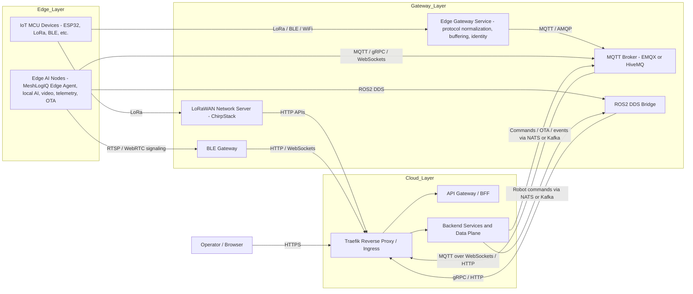
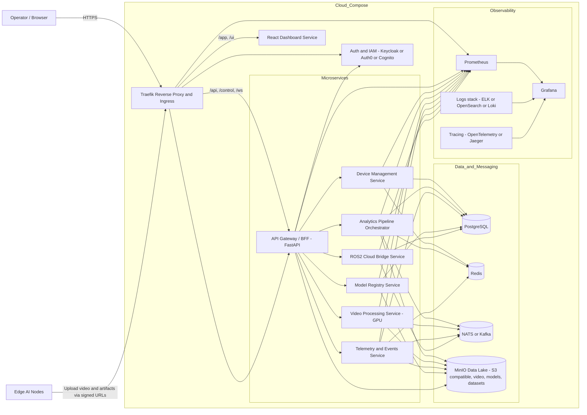

### **MeshLogIQ – Updated High-Level Platform Architecture**

MeshLogIQ is a distributed, multi‑tenant edge‑to‑cloud industrial AI platform. This revision introduces a unified **S3‑compatible data lake (MinIO)** and a **Traefik ingress/reverse‑proxy** as the front door to all backend services. All platform components—including storage, networking, microservices, and gateways—can now be launched and orchestrated via **Docker Compose** for local and developer deployments.

---

### **1. Core Architectural Principles**

- **Edge-first, cloud-managed** — Performance-critical AI/vision workloads run on edge nodes; cloud oversees orchestration.
- **Compose-first for development** — The entire control plane, data services, and ingress layer launch via Docker Compose.
- **MinIO as the unified data lake**  
  - Video archives  
  - Model registry artifacts  
  - Telemetry batch dumps  
  - Pipeline outputs  
- **Traefik as the reverse proxy & API gateway**
  - Auto-routing of all FastAPI, gRPC‑web, dashboard, and MQTT‑over‑WebSocket endpoints
  - Central TLS termination (Let’s Encrypt or local certs)
- **Microservice decomposed cloud backend** — All services containerized; stateless wherever possible.
- **Protocol-agnostic ingestion** and **GPU acceleration** at edge or cloud GPU nodes.
- **Multi‑tenant security** with federated identity + RBAC.
- **Streaming-first design** — Kafka/NATS + WebRTC + RTSP.

---

### **2. High-Level System Diagram**

**Edge Layer → Gateway Layer → Cloud Control Plane (Compose) → Application Layer**

Now including:

- **Traefik** fronting all HTTP/gRPC/WS traffic
- **MinIO** as the internal platform data lake
- **Docker Compose** orchestrating:  
  - API services  
  - Message broker  
  - DB/Redis  
  - MinIO  
  - Traefik ingress  
  - Observability stack
  - 
**High-Level Architecture (Edge → Gateway → Cloud)**

**Cloud / Docker-Compose Architecture**

---

### **3. Edge Architecture (No major change)**

Same as original; only note a change in **cloud communication endpoints** routed through Traefik.

Edge services communicate to cloud APIs using:

- `https://api.meshlogiq.local/device`
- MQTT over WebSockets routed by Traefik
- WebRTC signaling via Traefik

---

### **4. Gateway Layer (Same functionality, new routing)**

Gateways (MQTT broker, LoRaWAN LNS, BLE bridge, ROS bridge) sit behind Traefik when running in Compose:

- **Traefik exposes ingress:**
  - `/mqtt` → MQTT-over-WebSockets → EMQX/HiveMQ
  - `/lorawan` → ChirpStack API/UI
  - `/rosbridge` → ROS2 cloud bridge endpoint

This simplifies local development and cloud-like network behavior.

---

### **5. Cloud Backend Architecture (Updated)**

All services run as Docker containers, orchestrated by **docker-compose.yml**.

#### **5.1 Core Services in Compose**
- **Traefik** (reverse proxy / entrypoint / TLS)
- **FastAPI microservices**
- **gRPC service mesh** (service-to-service)
- **MinIO Data Lake**
- **PostgreSQL**
- **Redis**
- **NATS or Kafka**
- **Observability stack** (Prometheus, Grafana, Loki, Jaeger)

#### **5.2 MinIO Data Lake (New Component)**

MinIO provides:

- **Video storage** (raw streams, clipped events, inference outputs)
- **Model registry artifacts**
- **Dataset ingestion + export**
- **Pipeline outputs written as Parquet/JSON**
- **Tenant-isolated buckets**  
  - Example: `tenantA-videos/`, `tenantA-models/`, `tenantA-telemetry/`

Microservices interact with MinIO using S3 SDKs (boto3, MinIO Python SDK).

#### **5.3 Traefik Ingress (New Component)**

Traefik provides:

- Central routing for all backend APIs  
  Example routes:  
  - `/api/*` → FastAPI services  
  - `/control/*` → gRPC‑Web device mgmt  
  - `/ws/*` → WebSocket telemetry feed  
  - `/video/*` → WebRTC/RTSP signaling
- TLS termination
- Prometheus metrics  
- Automatic service discovery from Docker labels

Backend services become addressable via consistent subpaths/domains.

#### **5.4 Microservices (No major change, but now behind Traefik)**

- Device Management  
- Video Processing (GPU)  
- Analytics Pipeline Orchestrator  
- Model Registry  
- Telemetry/Events processor  
- ROS2 Bridge

All communicate internally via the Docker network using gRPC/Kafka.

---

### **6. Security & Multi-Tenancy (Updated)**

Traefik integrates with the IAM layer:

- **JWT validation middleware**
- Forward Auth to Keycloak/Auth0  
- Tenant-aware routing:
  - `/tenant/{id}/devices`
  - `/tenant/{id}/pipelines`

MinIO enforces tenant isolation through:

- Separate buckets per tenant  
- Per-tenant service account access policies

---

### **7. Frontend (React Dashboard)**

No structural changes, but traffic now flows:

`Browser → Traefik → Dashboard Service → Backend APIs`

Dashboard retrieves:

- Real-time video from WebRTC (signaling via Traefik)
- Telemetry over WebSockets proxied by Traefik
- Model/media artifacts pulled from MinIO (via signed URLs)

---

### **8. Deployment Strategy (Updated)**

#### **8.1 Development / Local**
**Single docker-compose up** runs:

- Traefik
- MinIO (+ console UI)
- PostgreSQL
- Redis
- NATS/Kafka
- FastAPI microservices
- Video pipeline (CPU fallback)
- Dashboard
- Observability stack

**Benefits:**

- All endpoints routed through Traefik to mimic production ingress  
- Devs can test MinIO-backed workflows locally  
- GPU-enabled Compose profiles support Jetsons or desktop GPUs  

#### **8.2 Production (same strategy)**
Move from Traefik-in-Compose to Traefik/Ingress-NGINX in Kubernetes.

#### **8.3 Edge Deployment**
Edge agents push data into MinIO via signed URLs generated by cloud services.

---

### **9. Observability (unchanged, but routed through Traefik)**

Traefik exposes:

- `/metrics` for Prometheus  
- `/dashboard` (optional)  

Log pipelines (Loki/ELK) remain modular.

---

### **10. Updated Tech Stack Summary**

**Programming languages**
- Python (backend, AI, orchestration)
- Rust/C++ extensions (performance-critical edge modules)
- TypeScript (frontend)

**Frameworks**
- FastAPI, gRPC, ROS2, Ray, MLflow

**Messaging & Streaming**
- NATS or Kafka
- MQTT
- WebRTC

**Storage**
- PostgreSQL  
- MinIO or S3 for video/model storage  
- Redis for caching

**Traefik** 
- reverse proxy
- ingress
- TLS  
 
**Deployment**
- Docker Compose  

**Security**
- Keycloak  
- mTLS  
- Secrets managed via Vault  

